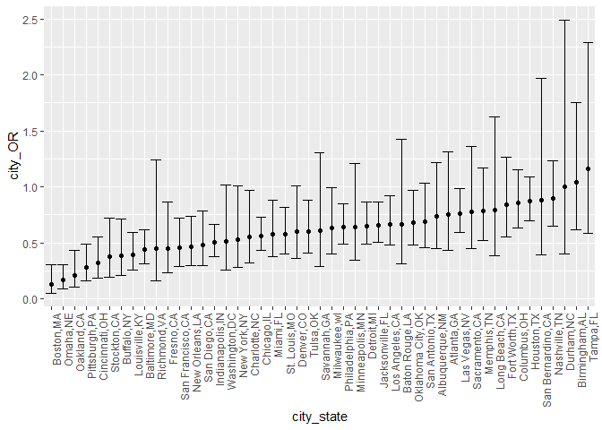
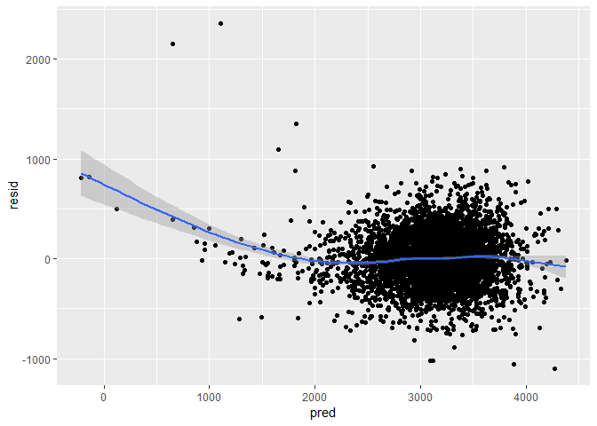
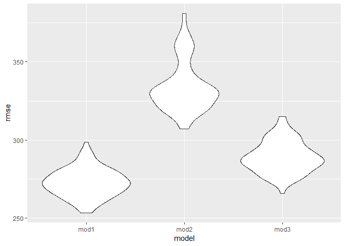

Homework 6
================
Bihui Sun

``` r
library(tidyverse)
```

    ## -- Attaching packages -------------------------------------------------------------------------------- tidyverse 1.2.1 --

    ## v ggplot2 3.0.0     v purrr   0.2.5
    ## v tibble  1.4.2     v dplyr   0.7.6
    ## v tidyr   0.8.1     v stringr 1.3.1
    ## v readr   1.1.1     v forcats 0.3.0

    ## -- Conflicts ----------------------------------------------------------------------------------- tidyverse_conflicts() --
    ## x dplyr::filter() masks stats::filter()
    ## x dplyr::lag()    masks stats::lag()

``` r
data=read_csv(file="C:/Users/lenovo/Desktop/p8105/data_import_examples/homicide-data.csv")
```

    ## Parsed with column specification:
    ## cols(
    ##   uid = col_character(),
    ##   reported_date = col_integer(),
    ##   victim_last = col_character(),
    ##   victim_first = col_character(),
    ##   victim_race = col_character(),
    ##   victim_age = col_character(),
    ##   victim_sex = col_character(),
    ##   city = col_character(),
    ##   state = col_character(),
    ##   lat = col_double(),
    ##   lon = col_double(),
    ##   disposition = col_character()
    ## )

``` r
data=data%>%
  mutate(city_state=str_c(city,state,sep=","))%>%
  mutate(ifsolved=ifelse(disposition=="Closed by arrest","solved","unsolved"))%>%
  filter(!(city_state%in%c("Dallas,TX","Phoenix,AZ","Kansas City,MO","Tulsa,AL")))%>%
  filter(!(victim_sex=="Unknown"))%>%
  mutate(victim_age=as.numeric(victim_age))%>%
  mutate(victim_race=ifelse(victim_race=="White","white","non-white"))%>%
  mutate(victim_race=as.character(victim_race))%>%
  mutate(victim_race=fct_relevel(victim_race,"white"))%>%
  mutate(ifsolved=as.numeric(ifsolved=="solved"))
```

    ## Warning in evalq(as.numeric(victim_age), <environment>): NAs introduced by
    ## coercion

``` r
data  
```

    ## # A tibble: 47,947 x 14
    ##    uid   reported_date victim_last victim_first victim_race victim_age
    ##    <chr>         <int> <chr>       <chr>        <fct>            <dbl>
    ##  1 Alb-~      20100504 GARCIA      JUAN         non-white           78
    ##  2 Alb-~      20100216 MONTOYA     CAMERON      non-white           17
    ##  3 Alb-~      20100601 SATTERFIELD VIVIANA      white               15
    ##  4 Alb-~      20100101 MENDIOLA    CARLOS       non-white           32
    ##  5 Alb-~      20100102 MULA        VIVIAN       white               72
    ##  6 Alb-~      20100126 BOOK        GERALDINE    white               91
    ##  7 Alb-~      20100127 MALDONADO   DAVID        non-white           52
    ##  8 Alb-~      20100127 MALDONADO   CONNIE       non-white           52
    ##  9 Alb-~      20100130 MARTIN-LEY~ GUSTAVO      white               56
    ## 10 Alb-~      20100210 HERRERA     ISRAEL       non-white           43
    ## # ... with 47,937 more rows, and 8 more variables: victim_sex <chr>,
    ## #   city <chr>, state <chr>, lat <dbl>, lon <dbl>, disposition <chr>,
    ## #   city_state <chr>, ifsolved <dbl>

``` r
data_Bal=data%>%
  filter(city_state=="Baltimore,MD")
model=glm(ifsolved ~ victim_age + victim_race + victim_sex, data = data_Bal, family = binomial())
fit_logistic=broom::tidy(model)
fit_logistic%>%
  mutate(OR=exp(estimate))%>%
  mutate(upperCI=exp(estimate+qnorm(0.975)*std.error))%>%
  mutate(lowerCI=exp(estimate-qnorm(0.975)*std.error))
```

    ## # A tibble: 4 x 8
    ##   term         estimate std.error statistic  p.value    OR upperCI lowerCI
    ##   <chr>           <dbl>     <dbl>     <dbl>    <dbl> <dbl>   <dbl>   <dbl>
    ## 1 (Intercept)   1.19      0.235        5.06 4.30e- 7 3.27    5.19    2.07 
    ## 2 victim_age   -0.00699   0.00326     -2.14 3.22e- 2 0.993   0.999   0.987
    ## 3 victim_race~ -0.820     0.175       -4.69 2.68e- 6 0.441   0.620   0.313
    ## 4 victim_sexM~ -0.888     0.136       -6.53 6.80e-11 0.412   0.537   0.315

``` r
allcity=data%>%
  select(city_state,ifsolved,victim_age,victim_race,victim_sex)%>%
  group_by(city_state)%>%
  nest()%>%
  mutate(newmodel=map(data,~glm(ifsolved ~ victim_age + victim_race + victim_sex, data= .x,family = binomial())))%>%
  mutate(result=map(newmodel,broom::tidy))%>%
  select(city_state,result)%>%
  unnest()%>%
  mutate(city_OR=exp(estimate))%>%
  mutate(upperCI=exp(estimate+qnorm(0.975)*std.error))%>%
  mutate(lowerCI=exp(estimate-qnorm(0.975)*std.error))%>%
  select(city_state,term,city_OR,upperCI,lowerCI)
allcity
```

    ## # A tibble: 188 x 5
    ##    city_state     term                 city_OR upperCI lowerCI
    ##    <chr>          <chr>                  <dbl>   <dbl>   <dbl>
    ##  1 Albuquerque,NM (Intercept)            3.62    7.76    1.69 
    ##  2 Albuquerque,NM victim_age             0.976   0.990   0.962
    ##  3 Albuquerque,NM victim_racenon-white   0.738   1.21    0.449
    ##  4 Albuquerque,NM victim_sexMale         1.58    2.78    0.894
    ##  5 Atlanta,GA     (Intercept)            3.17    6.43    1.56 
    ##  6 Atlanta,GA     victim_age             0.988   0.997   0.979
    ##  7 Atlanta,GA     victim_racenon-white   0.753   1.31    0.432
    ##  8 Atlanta,GA     victim_sexMale         0.990   1.44    0.679
    ##  9 Baltimore,MD   (Intercept)            3.27    5.19    2.07 
    ## 10 Baltimore,MD   victim_age             0.993   0.999   0.987
    ## # ... with 178 more rows

``` r
allcity%>%
  mutate(city_state = forcats::fct_reorder(city_state, city_OR))%>%
  ggplot(aes(x=city_state,y=city_OR))+
  geom_point()+
  geom_errorbar(aes(ymin=lowerCI,ymax=upperCI))+
  theme(axis.text.x = element_text(angle = 90, hjust = 1))
```



``` r
library(tidyverse)
library(modelr)
data=read_csv("C:/Users/lenovo/Desktop/p8105/data_import_examples/birthweight.csv")%>%
  mutate(babysex=as.factor(babysex))%>%
  mutate(frace=as.factor(frace))%>%
  mutate(malform=as.factor(malform))%>%
  mutate(mrace=as.factor(mrace))
```

    ## Parsed with column specification:
    ## cols(
    ##   .default = col_integer(),
    ##   gaweeks = col_double(),
    ##   ppbmi = col_double(),
    ##   smoken = col_double()
    ## )

    ## See spec(...) for full column specifications.

``` r
data=na.omit(data)
data
```

    ## # A tibble: 4,342 x 20
    ##    babysex bhead blength   bwt delwt fincome frace gaweeks malform menarche
    ##    <fct>   <int>   <int> <int> <int>   <int> <fct>   <dbl> <fct>      <int>
    ##  1 2          34      51  3629   177      35 1        39.9 0             13
    ##  2 1          34      48  3062   156      65 2        25.9 0             14
    ##  3 2          36      50  3345   148      85 1        39.9 0             12
    ##  4 1          34      52  3062   157      55 1        40   0             14
    ##  5 2          34      52  3374   156       5 1        41.6 0             13
    ##  6 1          33      52  3374   129      55 1        40.7 0             12
    ##  7 2          33      46  2523   126      96 2        40.3 0             14
    ##  8 2          33      49  2778   140       5 1        37.4 0             12
    ##  9 1          36      52  3515   146      85 1        40.3 0             11
    ## 10 1          33      50  3459   169      75 2        40.7 0             12
    ## # ... with 4,332 more rows, and 10 more variables: mheight <int>,
    ## #   momage <int>, mrace <fct>, parity <int>, pnumlbw <int>, pnumsga <int>,
    ## #   ppbmi <dbl>, ppwt <int>, smoken <dbl>, wtgain <int>

``` r
step(lm(bwt~babysex+bhead+blength+delwt+fincome+frace+gaweeks+malform+menarche+mheight+momage+mrace+parity+pnumlbw+pnumsga+ppbmi+ppwt+smoken+wtgain,data=data),direction="backward")
```

    ## Start:  AIC=48717.83
    ## bwt ~ babysex + bhead + blength + delwt + fincome + frace + gaweeks + 
    ##     malform + menarche + mheight + momage + mrace + parity + 
    ##     pnumlbw + pnumsga + ppbmi + ppwt + smoken + wtgain
    ## 
    ## 
    ## Step:  AIC=48717.83
    ## bwt ~ babysex + bhead + blength + delwt + fincome + frace + gaweeks + 
    ##     malform + menarche + mheight + momage + mrace + parity + 
    ##     pnumlbw + pnumsga + ppbmi + ppwt + smoken
    ## 
    ## 
    ## Step:  AIC=48717.83
    ## bwt ~ babysex + bhead + blength + delwt + fincome + frace + gaweeks + 
    ##     malform + menarche + mheight + momage + mrace + parity + 
    ##     pnumlbw + ppbmi + ppwt + smoken
    ## 
    ## 
    ## Step:  AIC=48717.83
    ## bwt ~ babysex + bhead + blength + delwt + fincome + frace + gaweeks + 
    ##     malform + menarche + mheight + momage + mrace + parity + 
    ##     ppbmi + ppwt + smoken
    ## 
    ##            Df Sum of Sq       RSS   AIC
    ## - frace     4    124365 320848704 48712
    ## - malform   1      1419 320725757 48716
    ## - ppbmi     1      6346 320730684 48716
    ## - momage    1     28661 320752999 48716
    ## - mheight   1     66886 320791224 48717
    ## - menarche  1    111679 320836018 48717
    ## - ppwt      1    131132 320855470 48718
    ## <none>                  320724338 48718
    ## - fincome   1    193454 320917792 48718
    ## - parity    1    413584 321137922 48721
    ## - mrace     3    868321 321592659 48724
    ## - babysex   1    853796 321578134 48727
    ## - gaweeks   1   4611823 325336161 48778
    ## - smoken    1   5076393 325800732 48784
    ## - delwt     1   8008891 328733230 48823
    ## - blength   1 102050296 422774634 49915
    ## - bhead     1 106535716 427260054 49961
    ## 
    ## Step:  AIC=48711.51
    ## bwt ~ babysex + bhead + blength + delwt + fincome + gaweeks + 
    ##     malform + menarche + mheight + momage + mrace + parity + 
    ##     ppbmi + ppwt + smoken
    ## 
    ##            Df Sum of Sq       RSS   AIC
    ## - malform   1      1447 320850151 48710
    ## - ppbmi     1      6975 320855679 48710
    ## - momage    1     28379 320877083 48710
    ## - mheight   1     69502 320918206 48710
    ## - menarche  1    115708 320964411 48711
    ## - ppwt      1    133961 320982665 48711
    ## <none>                  320848704 48712
    ## - fincome   1    194405 321043108 48712
    ## - parity    1    414687 321263390 48715
    ## - babysex   1    852133 321700837 48721
    ## - gaweeks   1   4625208 325473911 48772
    ## - smoken    1   5036389 325885093 48777
    ## - delwt     1   8013099 328861802 48817
    ## - mrace     3  13540415 334389119 48885
    ## - blength   1 101995688 422844392 49908
    ## - bhead     1 106662962 427511666 49956
    ## 
    ## Step:  AIC=48709.53
    ## bwt ~ babysex + bhead + blength + delwt + fincome + gaweeks + 
    ##     menarche + mheight + momage + mrace + parity + ppbmi + ppwt + 
    ##     smoken
    ## 
    ##            Df Sum of Sq       RSS   AIC
    ## - ppbmi     1      6928 320857079 48708
    ## - momage    1     28660 320878811 48708
    ## - mheight   1     69320 320919470 48708
    ## - menarche  1    116027 320966177 48709
    ## - ppwt      1    133894 320984044 48709
    ## <none>                  320850151 48710
    ## - fincome   1    193784 321043934 48710
    ## - parity    1    414482 321264633 48713
    ## - babysex   1    851279 321701430 48719
    ## - gaweeks   1   4624003 325474154 48770
    ## - smoken    1   5035195 325885346 48775
    ## - delwt     1   8029079 328879230 48815
    ## - mrace     3  13553320 334403471 48883
    ## - blength   1 102009225 422859375 49906
    ## - bhead     1 106675331 427525481 49954
    ## 
    ## Step:  AIC=48707.63
    ## bwt ~ babysex + bhead + blength + delwt + fincome + gaweeks + 
    ##     menarche + mheight + momage + mrace + parity + ppwt + smoken
    ## 
    ##            Df Sum of Sq       RSS   AIC
    ## - momage    1     29211 320886290 48706
    ## - menarche  1    117635 320974714 48707
    ## <none>                  320857079 48708
    ## - fincome   1    195199 321052278 48708
    ## - parity    1    412984 321270064 48711
    ## - babysex   1    850020 321707099 48717
    ## - mheight   1   1078673 321935752 48720
    ## - ppwt      1   2934023 323791103 48745
    ## - gaweeks   1   4621504 325478583 48768
    ## - smoken    1   5039368 325896447 48773
    ## - delwt     1   8024939 328882018 48813
    ## - mrace     3  13551444 334408523 48881
    ## - blength   1 102018559 422875638 49904
    ## - bhead     1 106821342 427678421 49953
    ## 
    ## Step:  AIC=48706.02
    ## bwt ~ babysex + bhead + blength + delwt + fincome + gaweeks + 
    ##     menarche + mheight + mrace + parity + ppwt + smoken
    ## 
    ##            Df Sum of Sq       RSS   AIC
    ## - menarche  1    100121 320986412 48705
    ## <none>                  320886290 48706
    ## - fincome   1    240800 321127090 48707
    ## - parity    1    431433 321317724 48710
    ## - babysex   1    841278 321727568 48715
    ## - mheight   1   1076739 321963029 48719
    ## - ppwt      1   2913653 323799943 48743
    ## - gaweeks   1   4676469 325562760 48767
    ## - smoken    1   5045104 325931394 48772
    ## - delwt     1   8000672 328886962 48811
    ## - mrace     3  14667730 335554021 48894
    ## - blength   1 101990556 422876847 49902
    ## - bhead     1 106864308 427750598 49952
    ## 
    ## Step:  AIC=48705.38
    ## bwt ~ babysex + bhead + blength + delwt + fincome + gaweeks + 
    ##     mheight + mrace + parity + ppwt + smoken
    ## 
    ##           Df Sum of Sq       RSS   AIC
    ## <none>                 320986412 48705
    ## - fincome  1    245637 321232048 48707
    ## - parity   1    422770 321409181 48709
    ## - babysex  1    846134 321832545 48715
    ## - mheight  1   1012240 321998651 48717
    ## - ppwt     1   2907049 323893461 48743
    ## - gaweeks  1   4662501 325648912 48766
    ## - smoken   1   5073849 326060260 48771
    ## - delwt    1   8137459 329123871 48812
    ## - mrace    3  14683609 335670021 48894
    ## - blength  1 102191779 423178191 49903
    ## - bhead    1 106779754 427766166 49950

    ## 
    ## Call:
    ## lm(formula = bwt ~ babysex + bhead + blength + delwt + fincome + 
    ##     gaweeks + mheight + mrace + parity + ppwt + smoken, data = data)
    ## 
    ## Coefficients:
    ## (Intercept)     babysex2        bhead      blength        delwt  
    ##   -6098.822       28.558      130.777       74.947        4.107  
    ##     fincome      gaweeks      mheight       mrace2       mrace3  
    ##       0.318       11.592        6.594     -138.792      -74.887  
    ##      mrace4       parity         ppwt       smoken  
    ##    -100.678       96.305       -2.676       -4.843

``` r
fit=lm(bwt~babysex+bhead+blength+delwt+fincome+gaweeks+mheight+mrace+parity+ppwt+smoken, data = data)
summary(fit)
```

    ## 
    ## Call:
    ## lm(formula = bwt ~ babysex + bhead + blength + delwt + fincome + 
    ##     gaweeks + mheight + mrace + parity + ppwt + smoken, data = data)
    ## 
    ## Residuals:
    ##      Min       1Q   Median       3Q      Max 
    ## -1097.18  -185.52    -3.39   174.14  2353.44 
    ## 
    ## Coefficients:
    ##               Estimate Std. Error t value Pr(>|t|)    
    ## (Intercept) -6098.8219   137.5463 -44.340  < 2e-16 ***
    ## babysex2       28.5580     8.4549   3.378 0.000737 ***
    ## bhead         130.7770     3.4466  37.944  < 2e-16 ***
    ## blength        74.9471     2.0190  37.120  < 2e-16 ***
    ## delwt           4.1067     0.3921  10.475  < 2e-16 ***
    ## fincome         0.3180     0.1747   1.820 0.068844 .  
    ## gaweeks        11.5925     1.4621   7.929 2.79e-15 ***
    ## mheight         6.5940     1.7849   3.694 0.000223 ***
    ## mrace2       -138.7925     9.9071 -14.009  < 2e-16 ***
    ## mrace3        -74.8868    42.3146  -1.770 0.076837 .  
    ## mrace4       -100.6781    19.3247  -5.210 1.98e-07 ***
    ## parity         96.3047    40.3362   2.388 0.017004 *  
    ## ppwt           -2.6756     0.4274  -6.261 4.20e-10 ***
    ## smoken         -4.8434     0.5856  -8.271  < 2e-16 ***
    ## ---
    ## Signif. codes:  0 '***' 0.001 '**' 0.01 '*' 0.05 '.' 0.1 ' ' 1
    ## 
    ## Residual standard error: 272.3 on 4328 degrees of freedom
    ## Multiple R-squared:  0.7181, Adjusted R-squared:  0.7173 
    ## F-statistic: 848.1 on 13 and 4328 DF,  p-value: < 2.2e-16

``` r
data %>% 
  select(bwt,babysex,bhead,blength,delwt,fincome,gaweeks,mheight,mrace,parity,ppwt,smoken)
```

    ## # A tibble: 4,342 x 12
    ##      bwt babysex bhead blength delwt fincome gaweeks mheight mrace parity
    ##    <int> <fct>   <int>   <int> <int>   <int>   <dbl>   <int> <fct>  <int>
    ##  1  3629 2          34      51   177      35    39.9      63 1          3
    ##  2  3062 1          34      48   156      65    25.9      65 2          0
    ##  3  3345 2          36      50   148      85    39.9      64 1          0
    ##  4  3062 1          34      52   157      55    40        64 1          0
    ##  5  3374 2          34      52   156       5    41.6      66 1          0
    ##  6  3374 1          33      52   129      55    40.7      66 1          0
    ##  7  2523 2          33      46   126      96    40.3      72 2          0
    ##  8  2778 2          33      49   140       5    37.4      62 1          0
    ##  9  3515 1          36      52   146      85    40.3      61 1          0
    ## 10  3459 1          33      50   169      75    40.7      64 2          0
    ## # ... with 4,332 more rows, and 2 more variables: ppwt <int>, smoken <dbl>

``` r
data %>% 
  add_residuals(fit)%>%
  
  add_predictions(fit)%>%
  gather(key = name, value = x, -bwt, -pred, -resid) %>%  
  ggplot(aes(x = x, y = bwt)) +  
  geom_segment(aes(xend = x, yend = pred), alpha = .2) +
  geom_point(aes(y = pred), shape = 1) +
  facet_grid(~ name, scales = "free_x") + 
  theme_bw()
```

    ## Warning: attributes are not identical across measure variables;
    ## they will be dropped



``` r
cv_df =
  crossv_mc(data, 100) %>% 
  mutate(train = map(train, as_tibble),
         test = map(test, as_tibble))%>%
  mutate(mod1 = map(train, ~lm(bwt~babysex+bhead+blength+delwt+fincome+gaweeks+mheight+mrace+parity+ppwt+smoken, data = .x)),
         mod2 = map(train, ~lm(bwt ~ blength+gaweeks, data = .x)),
         mod3 = map(train, ~lm(bwt~bhead+blength+babysex+bhead*blength+bhead*babysex+blength*babysex+bhead*babysex*blength,data=.x))) %>% 
  mutate(rmse_mod1 = map2_dbl(mod1, test, ~rmse(model = .x, data = .y)),
         rmse_mod2 = map2_dbl(mod2, test, ~rmse(model = .x, data = .y)),
         rmse_mod3 = map2_dbl(mod3, test, ~rmse(model = .x, data = .y)))
cv_df
```

    ## # A tibble: 100 x 9
    ##    train    test     .id   mod1  mod2  mod3  rmse_mod1 rmse_mod2 rmse_mod3
    ##    <list>   <list>   <chr> <lis> <lis> <lis>     <dbl>     <dbl>     <dbl>
    ##  1 <tibble~ <tibble~ 001   <S3:~ <S3:~ <S3:~      290.      358.      305.
    ##  2 <tibble~ <tibble~ 002   <S3:~ <S3:~ <S3:~      261.      311.      276.
    ##  3 <tibble~ <tibble~ 003   <S3:~ <S3:~ <S3:~      267.      315.      285.
    ##  4 <tibble~ <tibble~ 004   <S3:~ <S3:~ <S3:~      275.      317.      286.
    ##  5 <tibble~ <tibble~ 005   <S3:~ <S3:~ <S3:~      269.      318.      282.
    ##  6 <tibble~ <tibble~ 006   <S3:~ <S3:~ <S3:~      272.      325.      285.
    ##  7 <tibble~ <tibble~ 007   <S3:~ <S3:~ <S3:~      275.      342.      291.
    ##  8 <tibble~ <tibble~ 008   <S3:~ <S3:~ <S3:~      275.      337.      287.
    ##  9 <tibble~ <tibble~ 009   <S3:~ <S3:~ <S3:~      270.      335.      285.
    ## 10 <tibble~ <tibble~ 010   <S3:~ <S3:~ <S3:~      286.      364.      308.
    ## # ... with 90 more rows

``` r
cv_df %>% 
  select(starts_with("rmse")) %>% 
  gather(key = model, value = rmse) %>% 
  mutate(model = str_replace(model, "rmse_", ""),
         model = fct_inorder(model)) %>% 
  ggplot(aes(x = model, y = rmse)) + geom_violin()
```



-   The model building process I choose is stepwaise approaches, backward elimination, remove the variable with the greatest p-value one by one , and the predictors left are babysex,bhead,blength,delwt,fincome,gaweeks,mheight,mrace,parity,ppwt,smoken. From the rmse plot, we can see the first model is the one we want because it has lower rmse.
